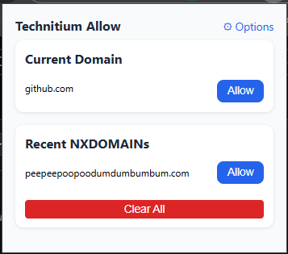
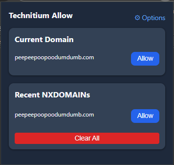
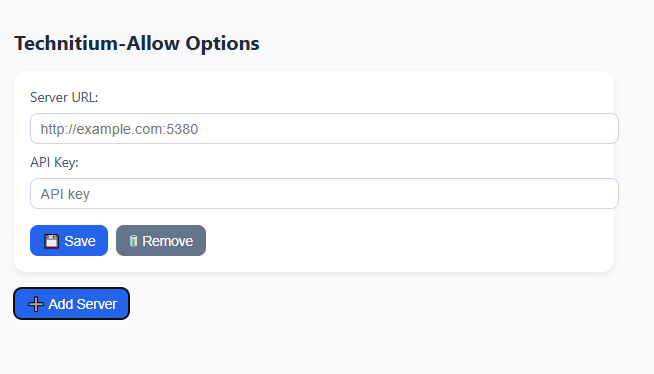
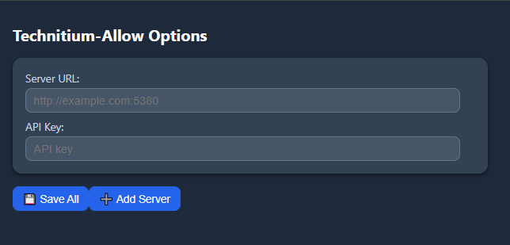

# Technitium-Allow

**Adds domains to Technitium DNS Allowed Zones when NXDOMAIN is encountered.**  

Technitium-Allow is a Chrome extension that detects domains that were blocked by Technitium and fail to resolve (NXDOMAIN) and allows you to quickly add them to your Technitium DNS Allowed Zones. It also maintains a history of NXDOMAINs and lets you manually add the current site.

---

## Features

- Automatically detects NXDOMAIN errors while browsing.
- Maintains a history of recently failed domains.
- Manually allow the current domain with a single click.
- Check/X indicators for success/failure of adding domains.
- Previously allowed domains are shown in green.
- Easy access to extension options from the popup.

---

## Screenshots

**Popup with NXDOMAIN history**  


**Options page**  


---

## Installation

### From Source (Developer Mode)

1. Clone the repository:
```bash
git clone https://github.com/<your-username>/technitium-allow.git
```
2. Open Chrome and navigate to chrome://extensions/.
3. Enable Developer mode (top-right toggle).
4. Click Load unpacked and select the repository folder (or src/ if you moved files there).
5. The extension should now appear in your toolbar.

### From GitHub Release (ZIP)

1. Go to the [Releases](https://github.com/drewstopherlee/technitium-allow/releases) page.
2. Download the latest .zip release.
3. Open Chrome chrome://extensions/.
4. Enable Developer mode.
5. Click Load unpacked and select the extracted .zip folder.

---

## Usage

1. Navigate to a website.
2. If the domain fails to resolve (NXDOMAIN), it will appear in the popup history.
3. Click Allow next to a domain to add it to Technitium DNS Allowed Zones.
4. To allow the current website, click Allow Current Domain in the popup.
5. Open Options from the top-right gear icon to configure your Technitium servers.

### Options Page

- Add one or more Technitium servers and their API keys.
- Each server will be tried when adding a domain.
- Stored servers are synced via Chrome storage.

---

## Folder Structure

```
technitium-allow/
├─ src/                  # HTML/JS source files
│   ├─ popup.html
│   ├─ popup.js
│   ├─ background.js
│   ├─ options.html
│   └─ options.js
├─ icons/                # Extension icons
├─ assets/               # Screenshots for README
├─ manifest.json
├─ README.md
├─ LICENSE
└─ .gitignore
```

---

## Contributing

1. Fork the repository.
2. Create a new branch (`git checkout -b feature-name`).
3. Make your changes and commit (`git commit -m "Add new feature"`).
4. Push to your branch (`git push origin feature-name`).
5. Open a pull request.

---

## License

This project is licensed under the MIT License. See the LICENSE file for details.
